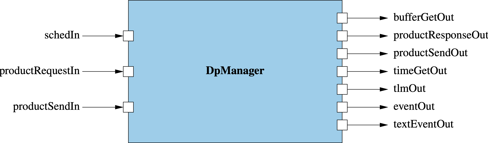

\page SvcDpManagerComponent Svc::DpManager Component
# Svc::DpManager (Queued Component)

## 1. Introduction

`Svc::DpManager` is a queued component.
It does the following:

1. Receive requests for buffers to hold data products.
When a client component _C_ requests a data product buffer, attempt to
allocate an `Fw::Buffer` from a buffer manager _M_.
If the attempt fails, then periodically retry.
When a buffer _B_ is allocated, convert _B_ to a data product buffer
_P_ and send _P_ to _C_ so that _C_ can fill it.

1. Receive data product buffers filled with data products by
client components.
Upon receiving a data product buffer _P_, convert _P_
to an `Fw::Buffer` _B_ and send _B_ out on a port.
Another component such as a Buffer Accumulator or Buffer Logger
will process _B_ and then send _B_ back to _M_ for deallocation.

## 2. Requirements

Requirement | Description | Rationale | Verification Method
----------- | ----------- | ----------| -------------------
SVC-DPMANAGER-001 | TODO | TODO | TODO

## 3. Design

### 3.1. Component Diagram

The diagram below shows the `DpManager` component.

### 3.2. Ports

`DpManager` has the following ports:

| Kind | Name | Port Type | Usage |
|------|------|-----------|-------|
| `sync input` | `schedIn` | `Svc.Sched` | Schedule in port |
| `async input` | `dpBufferRequestIn` | `Fw.DpBufferRequest` | Port for receiving buffer requests from a client component |
| `output` | `bufferGetOut` | `Fw.BufferGet` | Port for getting buffers from a Buffer Manager |
| `output` | `dpBufferSendOut` | `Fw.DpBufferSend` | Port for sending requested buffers to a client component |
| `async input` | `dpBufferSendIn` | `Fw.DpBufferSend` | Port for receiving data products from a client component |
| `output` | `bufferSendOut` | `Fw.BufferSend` | Port for sending data products to a downstream component |
| `time get` | `timeGetOut` | `Fw.Time` | Time get port |
| `telemetry` | `tlmOut` | `Fw.Tlm` | Telemetry port |
| `event` | `eventOut` | `Fw.Log` | Event port |
| `text event` | `textEventOut` | `Fw.LogText` | Text event port |

### 3.3. State

`DpManager` maintains the following state:

1. TODO

### 3.4. Header File Configuration

The `DpManager` header file provides the following configurable constants:

1. TODO

### 3.5. Runtime Setup

To set up an instance of `DpManager`, you do the following:

1. Call the constructor and the `init` method in the usual way
for an F Prime queued component.

1. TODO

### 3.6. Port Handlers

#### 3.6.1. schedIn

TODO

#### 3.6.2. dpBufferRequestIn

TODO

#### 3.6.3. dpBufferSendIn

TODO

### 3.7. Helper Functions

TODO

## 4. Ground Interface

### 4.1. Telemetry

TODO

### 4.2. Events

TODO

## 5. Example Uses

### 5.1. Topology Diagrams

TODO

### 5.2. Sequence Diagrams

TODO
