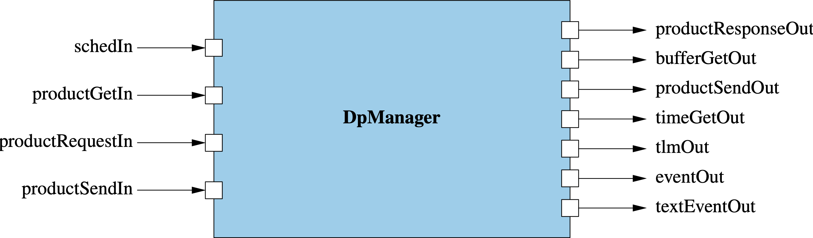

\page SvcDpManagerComponent Svc::DpManager Component
# Svc::DpManager (Active Component)

## 1. Introduction

`Svc::DpManager` is an active component for managing data products.
It does the following:

1. Receive requests for buffers to hold data products.
When a client component _C_ requests a data product buffer, 
request an `Fw::Buffer` _B_ from a buffer manager.
Send _B_ to _C_ so that _C_ can fill it.

1. Receive buffers filled with data products by
client components.
Upon receiving a buffer _B_, send _B_ on a port.
Another component such as a Buffer Accumulator or Buffer Logger
will process _B_ and then send _B_ back to the buffer manager
for deallocation.

## 2. Requirements

Requirement | Description | Rationale | Verification Method
----------- | ----------- | ----------| -------------------
SVC-DPMANAGER-001 | `Svc::DpManager` shall receive and asynchronously respond to  requests for data product buffers. | One purpose of the component is to provide data product buffers to clients. The asynchronous request-response prevents the client component from blocking on a guarded port. | Unit test
SVC-DPMANAGER-002 | `Svc::DpManager` shall receive data product buffers and forward them for further processing. | This requirement provides a pass-through capability for sending data product buffers to downstream components. `Svc::DpManager` receives data product input on a port of type  `Fw::DpSend`. This input consists of a container ID _id_ and an `Fw::Buffer` _B_. `Svc::DpManager` sends _B_ on a port of type `Fw::BufferSend`. This port type is used by the standard F Prime components for managing and logging data, e.g., `Svc::BufferLogger`. | Unit test

## 3. Design

### 3.1. Component Diagram

The diagram below shows the `DpManager` component.

### 3.2. Ports

`DpManager` has the following ports:

| Kind | Name | Port Type | Usage |
|------|------|-----------|-------|
| `async input` | `schedIn` | `Svc.Sched` | Schedule in port |
| `async input` | `productRequestIn` | `Fw.DpRequest` | Port for receiving data product buffer requests from a client component |
| `output` | `bufferGetOut` | `Fw.BufferGet` | Port for getting buffers from a Buffer Manager |
| `output` | `productResponseOut` | `Fw.DpSend` | Port for sending requested data product buffers to a client component |
| `async input` | `productSendIn` | `Fw.DpSend` | Port for receiving filled data product buffers from a client component |
| `output` | `productSendOut` | `Fw.BufferSend` | Port for sending filled data product buffers to a downstream component |
| `time get` | `timeGetOut` | `Fw.Time` | Time get port |
| `telemetry` | `tlmOut` | `Fw.Tlm` | Telemetry port |
| `event` | `eventOut` | `Fw.Log` | Event port |
| `text event` | `textEventOut` | `Fw.LogText` | Text event port |

### 3.3. State

`DpManager` maintains the following state:

1. `numSuccessfulAllocations`: The number of successful buffer allocations.

1. `numFailedAllocations`: The number of failed buffer allocations.

1. `numDataProducts`: The number of data products handled.

1. `numBytes:` The number of bytes handled.

### 3.4. Runtime Setup

No special runtime setup is required.

### 3.5. Port Handlers

#### 3.5.1. schedIn

The handler for this port sends out the state variables as telemetry.

#### 3.5.2. productRequestIn

This port receives container ID _id_ and a requested buffer size _size_.
It does the following:

1. Invoke `bufferGetOut` to get a buffer _B_.

1. If _B_ is valid, then increment `numAllocations`

1. Otherwise increment `numFailedAllocations` and emit a warning event.

1. send _(id, B)_ on `productResponseOut`.

#### 3.5.3. productSendIn

This port receives a data product ID _I_ and a buffer _B_.
It sends _B_ on `productSendOut`.

## 4. Ground Interface

### 4.1. Telemetry

| Name | Type | Description |
|------|------|-------------|
| `NumSuccessfulAllocations` | `U32` | The number of successful buffer allocations |
| `NumFailedAllocations` | `U32` | The number of failed buffer allocations |
| `NumDataProds` | `U32` | Number of data products handled |
| `NumBytes` | `U32` | Number of bytes handled |

### 4.2. Events

| Name | Severity | Description |
|------|----------|-------------|
| `BufferAllocationFailed` | `warning high` | Buffer allocation failed |

## 5. Example Uses

### 5.1. Topology Diagrams

The following topology diagrams show how to connect `Svc::DpManager`
to a client component, a buffer manager, and a buffer logger.
The diagrams use the following instances:

* `bufferLogger`: An instance of [`Svc::BufferLogger`](../../BufferLogger).

* `bufferManager`: An instance of [`Svc::BufferManager`](../../BufferManager/docs/sdd.md).

* `client`: A client component that generates data products.
`productRequestOut` is the special `product request` port.
`productRecvIn` is the special `product recv` port.

* `dpManager`: An instance of `Svc::DpManager`.

#### 5.1.1. Requesting Data Product Buffers

#### 5.1.2. Sending Data Products

### 5.2. Sequence Diagrams

#### 5.2.1. Requesting a Data Product Buffer

#### 5.2.2. Sending a Data Product

