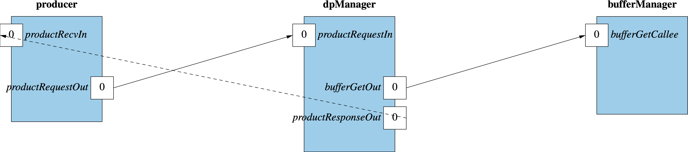
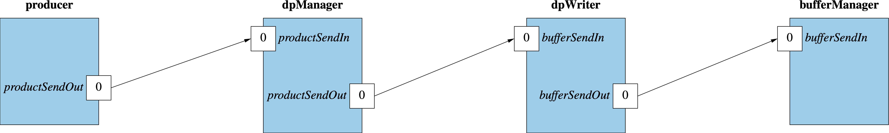

\page SvcDpManagerComponent Svc::DpManager Component
# Svc::DpManager (Active Component)

## 1. Introduction

`Svc::DpManager` is an active component for managing data products.
It does the following:

1. Receive requests for buffers to hold data products.
When a client component _C_ requests a data product buffer, attempt to
allocate an `Fw::Buffer` from a buffer manager _M_.
If the attempt fails, then periodically retry the allocation.
When a buffer _B_ is allocated, convert _B_ to a data product buffer
_P_ and send _P_ to _C_ so that _C_ can fill it.

1. Receive data product buffers filled with data products by
client components.
Upon receiving a data product buffer _P_, convert _P_
to an `Fw::Buffer` _B_ and send _B_ out on a port.
Another component such as a Buffer Accumulator or Buffer Logger
will process _B_ and then send _B_ back to _M_ for deallocation.

## 2. Requirements

Requirement | Description | Rationale | Verification Method
----------- | ----------- | ----------| -------------------
SVC-DPMANAGER-001 | `Svc::DpManager` shall receive and asynchronously respond to  requests for data product buffers. | One purpose of the component is to provide data product buffers to clients. The asynchronous request-response permits retrying of failed buffer allocations. | Unit test
SVC-DPMANAGER-002 | When a buffer allocation fails, `Svc::DpManager` shall retry the allocation up to a configurable number of times, at a configurable interval. | Retrying failed buffer requests provides a level of robustness in the client interface. If retrying is not desired, the retry count can be set to zero. | Unit test
SVC-DPMANAGER-003 | `Svc::DpManager` shall receive data product buffers, convert them to `Fw::Buffer` objects, and send the `Fw::Buffer` objects. | This requirement provides a pass-through capability that converts data product buffers to `Fw::Buffer` objects used by downstream components, e.g., `Svc::BufferLogger`. | Unit test

## 3. Design

### 3.1. Component Diagram

The diagram below shows the `DpManager` component.

### 3.2. Ports

`DpManager` has the following ports:

| Kind | Name | Port Type | Usage |
|------|------|-----------|-------|
| `async input` | `schedIn` | `Svc.Sched` | Schedule in port |
| `async input` | `dpBufferRequestIn` | `Fw.DpBufferRequest` | Port for receiving buffer requests from a client component |
| `output` | `bufferGetOut` | `Fw.BufferGet` | Port for getting buffers from a Buffer Manager |
| `output` | `dpBufferSendOut` | `Fw.DpBufferSend` | Port for sending requested buffers to a client component |
| `async input` | `dpBufferSendIn` | `Fw.DpBufferSend` | Port for receiving data products from a client component |
| `output` | `bufferSendOut` | `Fw.BufferSend` | Port for sending data products to a downstream component |
| `time get` | `timeGetOut` | `Fw.Time` | Time get port |
| `telemetry` | `tlmOut` | `Fw.Tlm` | Telemetry port |
| `event` | `eventOut` | `Fw.Log` | Event port |
| `text event` | `textEventOut` | `Fw.LogText` | Text event port |

### 3.3. State

`DpManager` maintains the following state:

1. `numRetry`: The number of times to retry a buffer
request before giving up and returning an invalid buffer.

2. `retryWaitTimeTicks`: The number of `schedIn` ticks
to wait before retrying a failed buffer request.

3. `bufferRequestSet`: The set of outstanding buffer requests.
Each request is a triple consisting of a container ID, a retry count,
and a wait count.
Initially the set is empty.

### 3.4. Header File Configuration

The `DpManager` header file provides the following configurable constants:

1. `DEFAULT_NUM_RETRY`: The default value of `numRetry`.

2. `DEFAULT_RETRY_WAIT_TIME_TICKS`: The default value of `retryWaitTimeTicks`.

3. `BUFFER_REQUEST_SET_MAX_SIZE`: The maximum size of `bufferRequestSet`.

### 3.5. Runtime Setup

To set up an instance of `DpManager`, do the following:

1. Call the constructor and the `init` method in the usual way
for an active component.

1. Optionally call the `configure` function to override the
default settings.

### 3.6. Port Handlers

#### 3.6.1. schedIn

For each triple _R = (id, retryCount, waitCount)_ in `bufferRequestSet` do:

1. If _waitCount == 0_ and _retryCount == 0_ then

   1. Emit a warning event.

   1. Let _B_ be an invalid buffer. Send _(id, B)_ on `dpBufferSendOut`.

   1. Remove _R_ from the set.

1. Otherwise if _waitCount == 0_

   1. Invoke `bufferGetOut` to get a buffer _B_.

   1. If _B_ is valid, then send _(id, B)_ on `dpBufferSendOut` and
      remove _P_ from the set.

   1. Otherwise decrement _retryCount_ and set _waitCount = retryWaitTimeTicks_.

1. Otherwise decrement _waitCount_.

#### 3.6.2. dpBufferRequestIn

This port receives container ID _id_ and a requested buffer size _size_.
It does the following:D

1. Invoke `bufferGetOut` to get a buffer _B_.

1. If _B_ is valid, then send _(id, B)_ on `dpBufferSendOut`.

1. Otherwise if there is no room left in `bufferRequestSet` then emit
a warning event.

1. Otherwise add _(id, numRetry, retryWaitTimeTicks)_ to `bufferRequestSet`.

#### 3.6.3. dpBufferSendIn

This port receives a data product ID _I_ and a buffer _B_.
It sends _B_ on `bufferSendOut`.

### 3.7. Helper Functions

TODO

### 3.8. Public Functions

#### 3.8.1. configure

The `configure` function sets the values of `numRetry` and `retryWaitTimeTicks`.

## 4. Ground Interface

### 4.1. Telemetry

TODO

### 4.2. Events

| Name | Description |
|------|-------------|
| `BufferAllocationFailed` | Buffer allocation failed |
| `BufferRequestSetFull` | Buffer request set is full |

## 5. Example Uses

### 5.1. Topology Diagrams

The following topology diagrams show how to connect `Svc::DpManager`
to a client component, a buffer manager, and a buffer logger.
The diagrams use the following instances:

* `bufferLogger`: An instance of [`Svc::BufferLogger`](../../BufferLogger).

* `bufferManager`: An instance of [`Svc::BufferManager`](../../BufferManager/docs/sdd.md).

* `client`: A client component that generates data products.
`productRequestOut` is the special `product request` port.
`productRecvIn` is the special `product recv` port.

* `dpManager`: An instance of `Svc::DpManager`.

#### 5.1.1. Requesting Data Product Buffers

#### 5.1.2. Sending Data Products

### 5.2. Sequence Diagrams

#### 5.2.1. Requesting a Data Product Buffer

#### 5.2.2. Sending a Data Product

