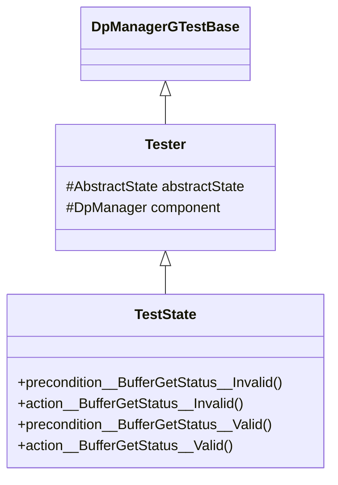
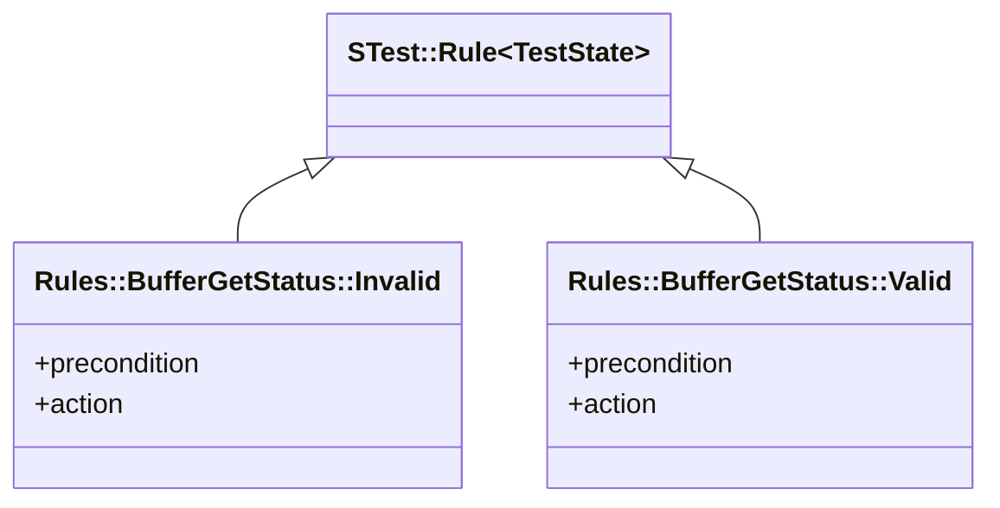
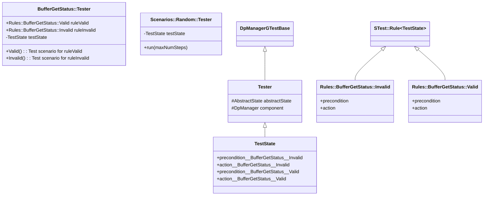

# DpManager Component Tests

## 1. Abstract State

### 1.1. Types

* `BufferGetStatus`: The status of the `bufferGet` response in
  the test harness (`VALID` or `INVALID`).

* `OnChangeChannel<T>`: A model of an on-change telemetry channel that
  stores type `T`.

### 1.2. Variables

| Variable | Type | Description | Initial Value |
|----------|------|-------------|---------------|
| `bufferGetStatus` | `BufferGetStatus` | The buffer get status | `VALID` |
| `NumSuccessfulAllocations` | `OnChangeChannel<U32>` | The number of successful buffer allocations | 0 |
| `NumFailedAllocations` | `OnChangeChannel<U32>` | The number of failed buffer allocations | 0 |
| `NumDataProducts` | `OnChangeChannel<U32>` | The number of data products handled | 0 |
| `NumBytes` | `OnChangeChannel<U32>` | The number of bytes handled | 0 |

## 2. Rule Groups

### 2.1. BufferGetStatus

This rule group manages the buffer get status in the test harness.

#### 2.1.1. Valid

This rule sets the buffer get status to `VALID`, simulating a system state
in which buffers are available.

**Precondition:**
`bufferGetStatus != VALID`.

**Action:**
`bufferGetStatus = VALID`.

**Test:**

1. Apply rule `BufferGetStatus::Invalid`.
1. Apply rule `BufferGetStatus::Valid`.

**Requirements tested:**
None (helper rule).

#### 2.1.2. Invalid

This rule sets the buffer get status to `INVALID`, simulating a system
state in which no buffers are available.

**Precondition:**
`bufferGetStatus != INVALID`.

**Action:**
`bufferGetStatus = INVALID`.

**Test:**
Apply rule `BufferGetStatus::Invalid`.

**Requirements tested:**
None (helper rule).

### 2.2. ProductRequestIn

This rule group sends test input to the `productRequestIn` port.

#### 2.2.1. BufferInvalid

This rule invokes `productRequestIn` in a state where the test harness returns
an invalid buffer.

**Precondition:**
`bufferGetStatus == INVALID`.

**Action:**

1. Clear the history.
1. Invoke `productRequestIn` with a random id _I_ and size _S_.
1. Assert that the event history contains one element.
1. Assert that the event history for `BufferAllocationFailed` contains _I_ at index zero.
1. Increment `NumFailedAllocations`.
1. Assert that the from port history contains two elements.
1. Assert that the history for `from_bufferGetOut` contains one element.
1. Assert that the history for `from_productResponseOut` contains one element.
1. Assert that the history for `productResponseOut` contains the expected invalid buffer
   and status `FAILURE` at index zero.

**Test:**

1. Apply rule `BufferGetStatus::Invalid`.
1. Apply rule `ProductRequestIn::BufferInvalid`.
1. Apply rule `SchedIn::OK`.

**Requirements tested:**
`SVC-DPMANAGER-001`, `SVC-DPMANAGER-003`.

#### 2.2.2. BufferValid

This rule invokes `productRequestIn` in a state where the test harness returns
a valid buffer.

**Precondition:**
`bufferGetStatus == VALID`.

**Action:**

1. Clear history.
1. Invoke `productRequestIn` with a random id _I_ and size _S_.
1. Assert that the event history is empty.
1. Increment `NumSuccessfulAllocations`.
1. Assert that the from port history contains two items.
1. Assert that the `from_bufferGetOut` history contains one item.
1. Assert that the `from_productResponseOut` history contains one item.
1. Assert that the `from_productResponseOut` history contains the
   expected valid buffer value and status `SUCCESS` at index zero.

**Test:**

1. Apply rule `ProductRequestIn::BufferValid`.
1. Apply rule `SchedIn::OK`.

**Requirements tested:**
`SVC-DPMANAGER-001`, `SVC-DP-MANAGER-003`.

### 2.3. ProductSendIn

This rule group sends test input to the `productSendIn` port.

#### 2.3.1. OK

This rule invokes `productSendIn` with nominal input.

**Precondition:** `true`.

**Action:**

1. Clear history.
1. Invoke `productSendIn` with a random id _I_ and buffer _B_.
1. Assert that the event history is empty.
1. Increment `NumDataBroducts`.
1. Increase `NumBytes` by the size of _B_.
1. Assert that the from port history contains one item.
1. Assert that the `from_productSendOut` history contains one item.
1. Assert that the `from_productSendOut` history contains _B_ at index zero.

**Test:**
Apply rule `ProductSendIn::OK`.
Apply rule `SchedIn::OK`.

**Requirements tested:**
`SVC-DPMANAGER-002`, `SVC-DPMANAGER-003`.

### 2.4. SchedIn

This rule group sends test input to the `schedIn` port.

#### 2.4.1. OK

This rule invokes `schedIn` with nominal input.

**Precondition:** `true`

**Action:**

1. Clear history.
1. Invoke `schedIn` with a random context.
1. Check telemetry.

**Test:**

1. Apply rule `SchedIn::OK`.

**Requirements tested:**
`SVC-DPMANAGER-003`.

## 3. Class Diagrams

### Tester and TestState

The abstract state is a member of the `Tester` class.
`TestState` is a derived class of `Tester`.
The preconditions and actions are defined in `TestState` so they can use the functions
and macros defined in `DpManagerGTestBase`.
The prototypes of the precondition and action functions are boilerplate and
are defined using macro expansion.

### Rules

The classes derived from `STest::Rule` are entirely boilerplate.
The precondition and action functions turn around and call the corresponding
functions in `TestState`.
The boilerplate is defined using macro expansion.

The tester and rules for the `BufferGetStatus` rule group are shown.

