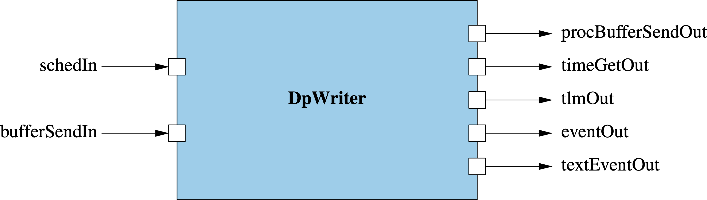

\page SvcDpWriterComponent Svc::DpWriter Component
# Svc::DpWriter (Active Component)

## 1. Introduction

`Svc::DpWriter` is an active component for writing data products to disk.
It does the following:

1. Receive buffers containing filled data product containers.
The buffers typically come from an instance of 
[`Svc::DpManager`](../../DpManager/docs/sdd.md),
either directly or via an instance 
of[`Svc::BufferAccumulator`](../../BufferAccumulator/docs/BufferAccumulator.md).

1. For each buffer _B_ received in step 1,

   1. Perform any requested processing, such as data compression, on _B_.

   1. Write _B_ to disk.

## 2. Requirements

Requirement | Description | Rationale | Verification Method
----------- | ----------- | ----------| -------------------
SVC-DPWRITER-001 | `Svc::DpWriter` shall provide a port for receiving `Fw::Buffer` objects pointing to filled data product containers. | The purpose of `DpWriter` is to write the data products to disk. | Unit Test
SVC-DPWRITER-002 | `Svc::DpWriter` shall provide an array of ports for sending `Fw::Buffer` objects for processing. | This requirement supports downstream processing of the data in the buffer. | Unit Test
SVC-DPWRITER-003 | On receiving a data product container _C_, `Svc::DpWriter` shall use the processor ID field of the header of _C_ to select the port index to use for processing. An out-of-bounds index shall signify no processing. | This requirement allows the data product producer to control the type of processing done. | Unit Test
SVC-DPWRITER-004 | On receiving an `Fw::Buffer` _B_, and after performing any requested processing on _B_, `Svc::DpWriter` shall write _B_ to disk. _TBD: Should the writes occur in priority order?_ | The purpose of `DpWriter` is to write data products to the disk. | Unit Test
SVC-DPWRITER-005 | When writing a buffer containing a data product _C_ to disk, `DpWriter` shall prepend (1) the priority value stored in the header of _C_ and (2) a hash value guarding the priority value. | This requirement allows another component, such as [`Svc::DpCatalog`](../../DpCatalog/docs/sdd.md), to update the priority without recomputing the hash for _C_. | Unit Test

## 3. Design

### 3.1. Component Diagram

The diagram below shows the `DpWriter` component.

### 3.2. Ports

`DpWriter` has the following ports:

| Kind | Name | Port Type | Usage |
|------|------|-----------|-------|
| `async input` | `schedIn` | `Svc.Sched` | Schedule in port |
| `async input` | `bufferSendIn` | `Fw.BufferSend` | Port for receiving data products to write to disk |
| `output` | `procBufferSendOut` | `[DpWriterNumProcPorts] Fw.BufferSend` | Port for processing data products |
| `time get` | `timeGetOut` | `Fw.Time` | Time get port |
| `telemetry` | `tlmOut` | `Fw.Tlm` | Telemetry port |
| `event` | `eventOut` | `Fw.Log` | Event port |
| `text event` | `textEventOut` | `Fw.LogText` | Text event port |

### 3.3. State

`DpWriter` maintains the following state:

TODO

### 3.4. Compile-Time Setup

The configuration constant [`DpWriterNumProcPorts`](../../../config/AcConstants.fpp)
specifies the number of ports for connecting components that perform
processing.

### 3.5. Runtime Setup

No special runtime setup is required.

### 3.6. Port Handlers

#### 3.6.1. schedIn

TODO

#### 3.6.2. bufferSendIn

TODO

## 4. Ground Interface

### 4.1. Telemetry

TODO

### 4.2. Events

TODO

## 5. Example Uses

### 5.1. Topology Diagrams

TODO

### 5.2. Sequence Diagrams

TODO
